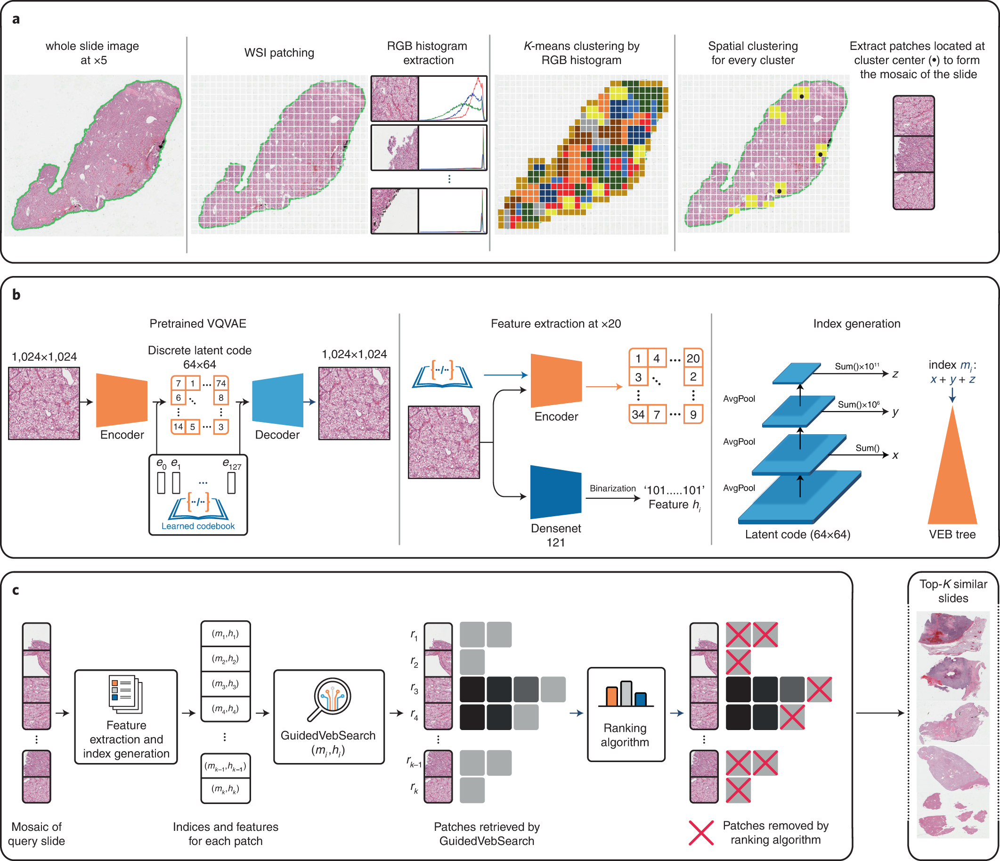

# hest_1k_data_analysis

### Inspect freshly downloaded samples

For each sample, we provide:

- **wsis/**: H&E-stained whole slide images in pyramidal Generic TIFF (or pyramidal Generic BigTIFF if >4.1GB)
- **st/**: Spatial transcriptomics expressions in a scanpy .h5ad object
- **metadata/**: Metadata
- **spatial_plots/**: Overlay of the WSI with the st spots
- **thumbnails/**: Downscaled version of the WSI
- **tissue_seg/**: Tissue segmentation masks:
    - `{id}_mask.jpg`: Downscaled or full resolution greyscale tissue mask
    - `{id}_mask.pkl`: Tissue/holes contours in a pickle file
    - `{id}_vis.jpg`: Visualization of the tissue mask on the downscaled WSI
- **pixel_size_vis/**: Visualization of the pixel size
- **patches/**: 256x256 H&E patches (0.5µm/px) extracted around ST spots in a .h5 object optimized for deep-learning. Each patch is matched to the corresponding ST profile (see **st/**) with a barcode.
- **patches_vis/**: Visualization of the mask and patches on a downscaled WSI.
- **transcripts/**: individual transcripts aligned to H&E for xenium samples; read with pandas.read_parquet; aligned coordinates in pixel are in columns `['he_x', 'he_y']`
- **cellvit_seg/**: Cellvit nuclei segmentation
- **xenium_seg**: xenium segmentation on DAPI and aligned to H&E


# H&E Breast 공간전사체 Cell 검출

담당자: 영섭 이
진행 상태: 완료
프로젝트: H&E 레벨 바이오마커 AI (https://www.notion.so/H-E-AI-26142971c02f8019860cefd1752d89d3?pvs=21)
태그: 참고
선행 작업: H&E Breast 공간전사체 Cell 검출 (https://www.notion.so/H-E-Breast-Cell-2a742971c02f80689daacb327d2dcfc8?pvs=21)
후속 작업: H&E Breast 공간전사체 Cell 검출 (https://www.notion.so/H-E-Breast-Cell-2a742971c02f80689daacb327d2dcfc8?pvs=21)
git repositories: https://github.com/Leeyoungsup/hest_1k_data_analysis

# DataSet




## 개요

- HEST-1k은 공간 전사체(Spatial Transcriptomics, ST) 데이터와 조직학 형광 또는 H&E 염색된 Whole Slide Image(WSI)를 **쌍(pair)** 으로 갖춘 대규모 데이터셋입니다. [Hugging Face+3arXiv+3NeurIPS Proceedings+3](https://arxiv.org/abs/2406.16192?utm_source=chatgpt.com)
- 정확히 말하면, 논문 기준으로 1,229개의 ST 프로파일이 대응되는 WSI와 메타데이터와 함께 제공됩니다. [NeurIPS Proceedings+1](https://proceedings.neurips.cc/paper_files/paper/2024/file/60a899cc31f763be0bde781a75e04458-Paper-Datasets_and_Benchmarks_Track.pdf?utm_source=chatgpt.com)
- 이 데이터셋은 26개의 기관(장기), 인간( Homo sapiens ) 및 마우스( Mus musculus ) 등 두 종(species)을 포함하며, 암 조직 샘플 또한 다양한 25개 암종(cancer types)에서 367개가 포함되어 있습니다. [arXiv+1](https://arxiv.org/abs/2406.16192?utm_source=chatgpt.com)
- 데이터셋의 처리를 통해 약 2.1 백만(expression–morphology) 페어(pair)와 7,600 만 개 이상의 핵(nuclei) 정보가 식별되었습니다. [arXiv+1](https://arxiv.org/abs/2406.16192?utm_source=chatgpt.com)
- 이와 함께 해당 팀은 “HEST‑Library”라는 파이썬 패키지도 공개하였고, ST+조직학 데이터를 보다 손쉽게 다루기 위한 라이브러리 기능을 제공합니다. [GitHub+1](https://github.com/mahmoodlab/HEST?utm_source=chatgpt.com)

## 구성 및 특징

**1. 범위 및 다양성**

- 26개의 장기(organ) 및 두 종(species)을 아우르며, 암 및 정상조직 포함. [NeurIPS Proceedings](https://proceedings.neurips.cc/paper_files/paper/2024/file/60a899cc31f763be0bde781a75e04458-Paper-Datasets_and_Benchmarks_Track.pdf?utm_source=chatgpt.com)
- 다양한 ST 기술(예: Visium, Xenium 등)과 다양한 형식의 WSI가 포함되어 있습니다. [Hugging Face+1](https://huggingface.co/datasets/MahmoodLab/hest?utm_source=chatgpt.com)

**2. 이미지 + 전사체 데이터의 정렬(alignment)**

- 각 WSI는 해당 ST 스폿(spot) 또는 세포(cell) 위치와 정렬되어 있으며, 이에 따라 조직 형태(morphology)와 유전자 발현(expression) 정보가 공간적으로 연결되어 있습니다. [arXiv+1](https://arxiv.org/abs/2406.16192?utm_source=chatgpt.com)
- 예컨대 WSI 위에 ST 스폿이 겹쳐 표시된 시각화(spatial_plots)도 제공됩니다. [Hugging Face](https://huggingface.co/datasets/MahmoodLab/hest?utm_source=chatgpt.com)

**3. 데이터 구성 구조**

- 다운로드하면 `wsis/` (H&E 염색된 WSI 파일), `st/` (scanpy `.h5ad` 포맷의 ST 표현 데이터), `metadata/`, `spatial_plots/`, `tissue_seg/` (조직 마스크 등) 폴더 등이 포함되어 있습니다. [Hugging Face+1](https://huggingface.co/datasets/MahmoodLab/hest?utm_source=chatgpt.com)
- 데이터 전체 용량이 매우 큽니다(1 TB 이상) — 따라서 관심 있는 샘플만 선택해 다운로드할 수 있도록 설계되어 있습니다. [GitHub](https://github.com/mahmoodlab/HEST?utm_source=chatgpt.com)

# Data Preprocessing

Image : Slide이미지

Label : csv 형식의 x1,y1,x2,y2,class_name column

```python
# Class list
class_list = {
    0: "Tumor epithelial",
    1: "Non-tumor epithelial",
    2: "Basal/Myoepithelial",
    3: "Smooth muscle",
    4: "Fibroblast",
    5: "Endothelial",
    6: "T cell",
    7: "B cell",
    8: "Plasma cell",
    9: "Myeloid",
    10: "Adipocyte",
    11: "Other/Unknown"
}
marker_genes = {
    'Tumor epithelial': [
        b'EPCAM', b'KRT14', b'KRT5', b'KRT23', b'ERBB2', b'MKI67', b'GATA3'
    ],
    'Non-tumor epithelial': [
        b'EPCAM', b'KRT8', b'KRT18', b'KRT19', b'CDH1'
    ],
    'Basal/Myoepithelial': [
        b'KRT5', b'KRT14', b'ACTA2', b'MYL9'
    ],
    'Smooth muscle': [
        b'ACTA2', b'MYH11', b'TAGLN', b'MYLK', b'MYL9'
    ],
    'Fibroblast': [
        b'PDGFRA', b'PDGFRB', b'DPT', b'LUM', b'SFRP1', b'FBLN1', b'SFRP4'
    ],
    'Endothelial': [
        b'PECAM1', b'KDR', b'CD93', b'EGFL7', b'VWF', b'CLEC14A'
    ],
    'T cell': [
        b'CD3D', b'CD3E', b'CD3G', b'NKG7', b'GZMA', b'CCL5', b'TRAC', b'TCF7', b'LTB', b'IL2RG'
    ],
    'B cell': [
        b'CD79A', b'CD79B', b'MS4A1', b'MZB1', b'CD19', b'PAX5'
    ],
    'Plasma cell': [
        b'MZB1', b'PRDM1', b'TNFRSF17'
    ],
    'Myeloid': [
        b'CD68', b'CD14', b'CD163', b'MRC1', b'C1QA', b'AIF1',
        b'S100A8', b'CD86', b'ITGAX', b'TPSAB1', b'CPA3', b'KIT'
    ],
    'Adipocyte': [
        b'ADIPOQ', b'LPL', b'PPARG'
    ],
    'Other/Unknown': []
}
class_colors_hex = {
    "Tumor epithelial": "#FF0000",
    "Non-tumor epithelial": "#FFB6C1",
    "Basal/Myoepithelial": "#FFA500",
    "Smooth muscle": "#8B4513",
    "Fibroblast": "#00FF00",
    "Endothelial": "#0000FF",
    "T cell": "#FFFF00",
    "B cell": "#FF00FF",
    "Plasma cell": "#9400D3",
    "Myeloid": "#00FFFF",
    "Adipocyte": "#FFC0CB",
    "Other/Unknown": "#808080"
}
class_colors = {
    "Tumor epithelial": [255, 0, 0],        # 빨강 - 종양
    "Non-tumor epithelial": [255, 182, 193],  # 연한 분홍 - 정상 상피
    "Basal/Myoepithelial": [255, 165, 0],   # 주황 - 기저/근상피
    "Smooth muscle": [139, 69, 19],          # 갈색 - 평활근
    "Fibroblast": [0, 255, 0],               # 초록 - 섬유아세포
    "Endothelial": [0, 0, 255],              # 파랑 - 혈관내피
    "T cell": [255, 255, 0],                 # 노랑 - T세포
    "B cell": [255, 0, 255],                 # 마젠타 - B세포
    "Plasma cell": [148, 0, 211],            # 보라 - 형질세포
    "Myeloid": [0, 255, 255],                # 시안 - 골수계
    "Adipocyte": [255, 192, 203],            # 분홍 - 지방세포
    "Other/Unknown": [128, 128, 128]         # 회색 - 기타/미분류
}

```

```python
#cell 타입 대입 bounding box label processing
import json
import pandas as pd
import os
import shutil
from glob import glob
import zipfile
import numpy as np
from tqdm import tqdm
from shapely import wkb
from shapely.geometry import shape
def create_dir(path):
    if not os.path.exists(path):
        os.makedirs(path)
QV_THRESHOLD = 20 
xenium_annotation_list=glob('../../data/Brest_spatialTranscriptome/xenium_seg/*_xenium_nucleus_seg.parquet')
xenium_wsi_list = [f.replace("xenium_seg/", "wsis/") for f in xenium_annotation_list]
xenium_wsi_list = [f.replace("_xenium_nucleus_seg.parquet", ".tif") for f in xenium_wsi_list]
xenium_metadata_list = [f.replace("wsis/", "metadata/") for f in xenium_wsi_list]
xenium_metadata_list = [f.replace(".tif", ".json") for f in xenium_metadata_list]
save_path='../../data/Brest_spatialTranscriptome/preprocessed_xenium/'
for i in tqdm(range(len(xenium_annotation_list))):
    zip_path = xenium_annotation_list[i]
    wsi_path = xenium_wsi_list[i]
    create_dir(save_path+'wsis/')
    create_dir(save_path+'metadata/')
    shutil.copy(wsi_path, f'{save_path}wsis/{os.path.basename(wsi_path)}')
    shutil.copy(xenium_metadata_list[i], f'{save_path}metadata/{os.path.basename(xenium_metadata_list[i])}')
def classify_cell_by_genes(gene_list, marker_dict):
    """여러 유전자를 기반으로 cell type scoring"""
    scores = {cell_type: 0 for cell_type in marker_dict.keys()}
    
    for gene in gene_list:
        for cell_type, markers in marker_dict.items():
            if gene in markers:
                scores[cell_type] += 1
    
    # 가장 높은 점수의 cell type 반환
    max_score = max(scores.values())
    if max_score == 0:
        return 'Other/Unknown', 0
    
    best_type = max(scores, key=scores.get)
    return best_type, scores
save_path='../../data/Brest_spatialTranscriptome/preprocessed_xenium/'
xenium_transcripts_list=[f.replace("xenium_seg/", "transcripts/") for f in xenium_annotation_list]
xenium_transcripts_list=[f.replace("_xenium_nucleus_seg.parquet", "_transcripts.parquet") for f in xenium_transcripts_list]
for i in range(len(xenium_transcripts_list)):
    xenium_transcript_path = xenium_transcripts_list[i]
    df_transcript = pd.read_parquet(xenium_transcript_path)
    df_filtered = df_transcript[df_transcript['qv'] > QV_THRESHOLD].copy()
    
    df_filtered = df_filtered[~df_filtered['feature_name'].str.decode('utf-8').str.contains('BLANK|NegControl|antisense', case=False, na=False)]
    xenium_annotation_path=xenium_annotation_list[i]
    df_seg = pd.read_parquet(xenium_annotation_path)
    df=pd.DataFrame(columns=['x1','y1','x2','y2','class_name'])
    annotations = []
    grouped_transcripts = df_filtered.groupby('cell_id')['feature_name'].apply(list).to_dict()
    for j in tqdm(range(len(df_seg))):
        temp_df_seg=df_seg.iloc[j]
        cell_id=temp_df_seg.name
        geom_binary=temp_df_seg['geometry']
        polygon = wkb.loads(geom_binary)
        x,y=polygon.exterior.xy
        x1=int(np.min(x))
        y1=int(np.min(y))
        x2=int(np.max(x))
        y2=int(np.max(y))
        try:
            genes_in_cell=grouped_transcripts[cell_id]
            cell_type, score = classify_cell_by_genes(genes_in_cell, marker_genes)
            annotations.append({
                'x1': x1,
                'y1': y1,
                'x2': x2,
                'y2': y2,
                'class_name': cell_type,
            })
        except KeyError:
            continue
    df = pd.DataFrame(annotations)
    create_dir(save_path+'labels/')    
    df.to_csv(save_path+'labels/'+os.path.basename(xenium_annotation_path).replace('_xenium_nucleus_seg.parquet', '.csv'), index=False)
```


#